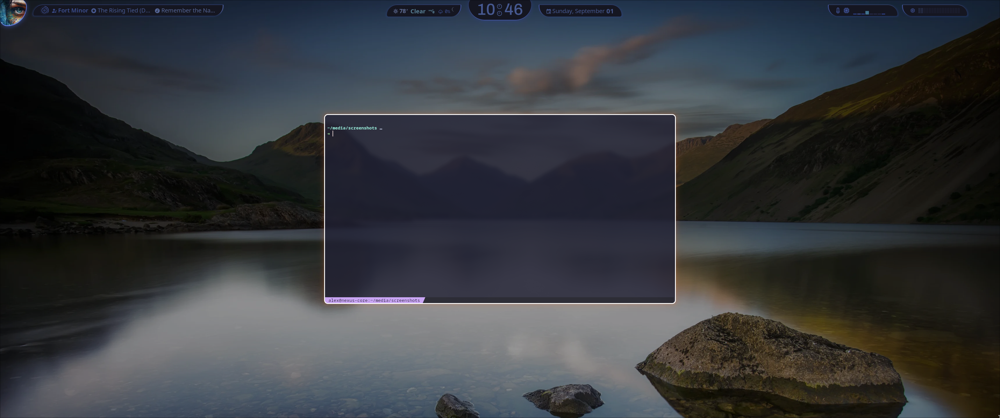
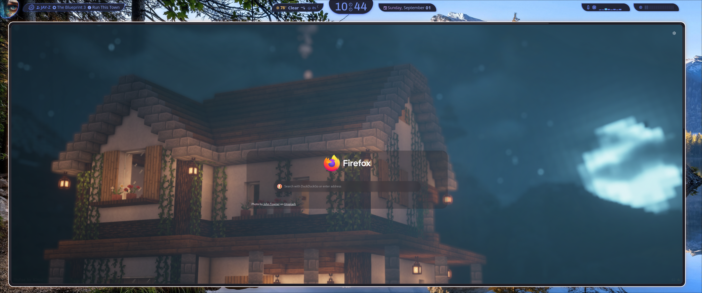
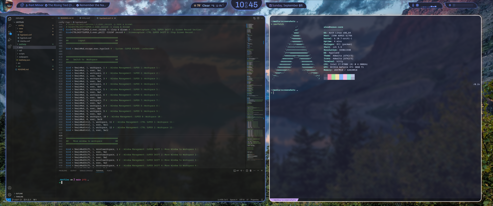

# And so it starts again (FYI most of these configs are stolen and altered)

## Screenshots






# Setup (WIP)

## Backing up / installing from package list

```bash
# Backing up to list
sudo pacman -Qqen > pacmanlist.txt
sudo pacman -Qqem > aurlist.txt

# Installing from list
sudo pacman -S --needed - < pacmanlist.txt
yay -S --needed - < aurlist.txt
```

## BIOS Updates

```bash

sudo pacman -Syu fwupd
sudo fwupdmgr get-updates
sudo fwupdmgr update

```

## ZSH Setup

```bash

sudo pacman -Syu zsh
sudo chsh -s /bin/zsh
wget <https://raw.githubusercontent.com/ohmyzsh/ohmyzsh/master/tools/install.sh>
cat install.sh | less
sh install
rm install.sh
git clone --depth 1 -- <https://github.com/marlonrichert/zsh-autocomplete.git> ${ZSH_CUSTOM:-~/.oh-my-zsh/custom}/plugins/zsh-autocomplete
git clone https://github.com/zsh-users/zsh-syntax-highlighting.git ${ZSH_CUSTOM:-~/.oh-my-zsh/custom}/plugins/zsh-syntax-highlighting
rm ~/.zshrc # Because we will be using our own zsh config

```

## Neovim Setup

```bash

git clone <https://github.com/NvChad/starter> ~/.config/nvim && nvim

```

## Yazi (CLI File Previewer)

```bash

sudo pacman -Syu yazi ffmpegthumbnailer p7zip jq poppler fd ripgrep fzf zoxide imagemagick

```

## Screenshots

```bash

sudo pacman -Syu slurp wl-clipboard dunst grim

```

## Screen Locker

```bash

sudo pacman -Syu hyprlock

```

## Time to link our own configs

```bash

mv ~/.config/nvim ~/.config/nvim.bak
mv ~/.zshrc ~/.zshrc.bak
cd ~/.dotfiles/
stow .

```

## Sddm theme setup

```bash
<https://github.com/birbkeks/win11-sddm-theme>

# Download listed themes, then unzip and move to font directory

mv *.ttf /home/alex/.local/share/fonts

# Then download the main release from github, unzip and move to sddm themes directory

tar -xvf win11-sddm-theme
sudo mv win11-sddm-theme /usr/share/sddm/themes

# Change /etc/sddm.conf theme

# Change this line

Current=

# to

Current=win11-sddm-theme

# also, if you are just deploying this from config, then the /etc/sddm.conf in the dotfiles already includes this, so you could just link it with

sudo stow --target /etc etc

```

## Universal Keybind Helper

```bash

mkdir ~/Tools/kebihelp && cd ~/Tools/kebihelp
python3 -m venv venv
source ./venv/bin/activate
pip install kebihelp
kebihelp show -a

# I changed the fonts as well
<https://fonts.google.com/selection>
unzip Dancing_Script.zip
mv static/*.ttf /home/alex/.local/share/fonts
mv DancingScript-VariableFont_wght.ttf /home/alex/.local/share/fonts/
fc-cache -fv

```

## New Hyprland Nvidia specific stuff

```bash
# VA-API hardware video acceleration for electron apps

sudo pacman -Syu libva-nvidia-driver

# Add following to hyprland config

env = NVD_BACKEND,direct
```

## VSCode API fixes, allows logging in, python always loading fix, etc

```bash
yay -S code-features
```

## VSCode Keyring issue when trying to log in to cloud sync

```bash
# Edit ~/.vscode/argv.json or ~/.vscode-oss/argv.json and add following
"password-store": "gnome-libsecret",
```
